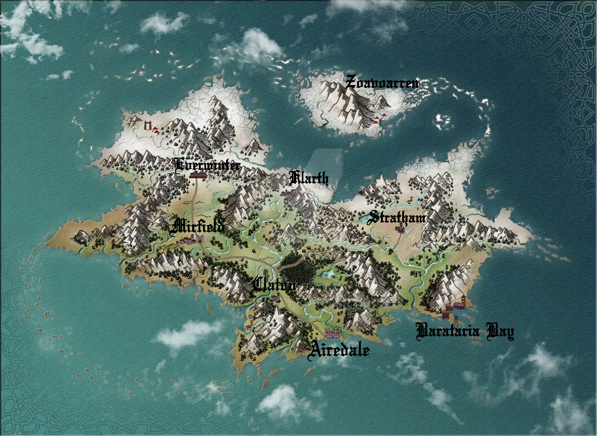

# Iostria

# Contents

- [Contents](#contents)
	- [1 The Gods](#1-the-gods)
		- [1.1 Izotl The god of gods](#11-izotl-the-god-of-gods)
		- [1.2 Children of the light](#12-children-of-the-light)
			- [1.2.1. Zodlios, The God of Justice](#121-zodlios-the-god-of-justice)
			- [1.2.2. Hecataeus, The God of wisdom](#122-hecataeus-the-god-of-wisdom)
			- [1.2.3. Dhemes The God of madness](#123-dhemes-the-god-of-madness)
		- [1.3 Children of Nature](#13-children-of-nature)
			- [1.3.1. Chisemis, The God of the earth (rocks, ground etc)](#131-chisemis-the-god-of-the-earth-rocks-ground-etc)
			- [1.3.2. Cephine, The Goddess of the Wilderness (forests, swamps etc)](#132-cephine-the-goddess-of-the-wilderness-forests-swamps-etc)
			- [1.3.3. Lognar, The God of water and the seas](#133-lognar-the-god-of-water-and-the-seas)
		- [1.4 Children of the dark](#14-children-of-the-dark)
			- [1.4.1. Danir, The God of Desire](#141-danir-the-god-of-desire)
			- [1.4.2. Adrena, The Goddess of Kindness](#142-adrena-the-goddess-of-kindness)
			- [1.4.3. Medona, The Goddess of Joy](#143-medona-the-goddess-of-joy)
	- [2. DEATH AND THE GREAT MIST](#2-death-and-the-great-mist)
	- [3. DEMIGODS](#3-demigods)
		- [3.1. Edward 'The undead' Thorn](#31-edward-the-undead-thorn)
		- [3.2. The Monstrosities](#32-the-monstrosities)
			- [3.2.1. Yuan-ti](#321-yuan-ti)
	- [4. LARGE CITIES \& NOTABLE PLACES](#4-large-cities--notable-places)
		- [4.1. Airedale](#41-airedale)
		- [4.2. The King](#42-the-king)
		- [4.3. Stratham](#43-stratham)
		- [4.4. Claton](#44-claton)
		- [4.5. Klarth](#45-klarth)
		- [4.6. Mirfield](#46-mirfield)
		- [4.7. Everwinter](#47-everwinter)
		- [4.8. Zoavoarren](#48-zoavoarren)
		- [4.9. The traveler’s path](#49-the-travelers-path)
		- [4.10. The phantasmal forest](#410-the-phantasmal-forest)
		- [4.11. The simmering swamp](#411-the-simmering-swamp)
		- [4.12. The lost desert](#412-the-lost-desert)
		- [4.13. The tribal valley](#413-the-tribal-valley)
		- [4.14. The fishermans bay](#414-the-fishermans-bay)
		- [4.15. Barataria Bay](#415-barataria-bay)
	- [5. Races](#5-races)
		- [5.1. Human](#51-human)
		- [5.2. Hollow one](#52-hollow-one)
		- [5.3. Ashen one](#53-ashen-one)
			- [5.3.1. Traits](#531-traits)
			- [5.3.2. Age](#532-age)
			- [5.3.3. List of abilities available for Ashen ones depending on character class:](#533-list-of-abilities-available-for-ashen-ones-depending-on-character-class)
		- [5.4. Tiefling of Iostria](#54-tiefling-of-iostria)
		- [5.5. Dragonborn](#55-dragonborn)
		- [5.6. Warforged](#56-warforged)
		- [5.7. Dwarf](#57-dwarf)
		- [5.8. Elf](#58-elf)
		- [5.9. Firbolg](#59-firbolg)
		- [5.10. Gnome](#510-gnome)
		- [5.11. Goblin](#511-goblin)
		- [5.12. Half-elf](#512-half-elf)
		- [5.13. Half-orc](#513-half-orc)
		- [5.14. Halfling](#514-halfling)
		- [5.15. Kenku](#515-kenku)
		- [5.16. Tabaxi](#516-tabaxi)
		- [5.17. Tortle](#517-tortle)
	- [6. Monsters](#6-monsters)
		- [6.1. Werewolf](#61-werewolf)
		- [6.2. Wolf](#62-wolf)
		- [6.3. Orc](#63-orc)
	- [7. Mechanics](#7-mechanics)
		- [7.1. Body decaying](#71-body-decaying)
		- [7.2. Drain](#72-drain)
		- [7.3 Marshall clash](#73-marshall-clash)
		- [7.4 Healing potions](#74-healing-potions)
	- [8. Magic Items](#8-magic-items)
		- [8.1 Sword of revenance](#81-sword-of-revenance)
		- [8.2 Longbow of the fallen](#82-longbow-of-the-fallen)
		- [8.3 Crusader modular  maul](#83-crusader-modular-maul)
	- [9. Battles and politics](#9-battles-and-politics)
		- [9.1 Control of the Traveler's path](#91-control-of-the-traveler's-path)
	- [12. Custom Classes](#12-custom-classes)
		- [12.1. Elemental Fighter (5e Class)](#121-elemental-fighter-5e-class)
			- [12.1.1. Elemental Fighter](#1211-elemental-fighter)
			- [12.1.2. Creating an Elemental Fighter](#1212-creating-an-elemental-fighter)
				- [12.1.2.1. Quick Build](#12121-quick-build)
			- [12.1.3. Class Features](#1213-class-features)
				- [12.1.3.1. Hit Points](#12131-hit-points)
				- [12.1.3.2. Proficiencies](#12132-proficiencies)
				- [12.1.3.3. Equipment](#12133-equipment)
				- [12.1.3.4. Elemental Affinity](#12134-elemental-affinity)

# 1 The Gods
[Contents](#contents)

## 1.1 Izotl The god of gods
other names: The one above all, The creator  
He is the Father of all the other gods.  
He ruled Iostria for millennia but has recently dissapeared leaving his seat as the supreme god. 
Causing a sort of cold war between the lower gods. These gods are now making alliances and vying for power over each other.

## 1.2 Children of the light
[Contents](#contents)

### 1.2.1. Zodlios, The God of Justice 
Other names: The god of cruelty, The god of strength  
Worshipped by the king and is the god of the great kingdom based in Airedale. As such his main temple is also located there.  
Holy symbol is the sun held over on the tip of a sword.  
He is one of the frontrunners among the gods to attain Izotls old position as a supreme deity.  

Main codes of conduct;  
	- The law is absolute.  
	- You don't get a second chance, once a criminal allways a criminal.  
	- Be wary of strangers, don't trust people of other faiths.  
	- Strenght through law & order.  
 	- Creatures with no laws or gods should be treated as subhuman.  

### 1.2.2. Hecataeus, The God of wisdom
Other names: The wise one, The enlightened one  
worshipped by most scholars and wizards  
Holy symbol is an owl  
Most of his worshippers and the main temple of Hecateus are located in Stratham.  

Main codes of conduct;  
	- Strive for enlightenment through academics.  
 	- We exist within the boundaries of nature, as such those boundaries should be respected.  
  	- Some things are beyond the understanding of mortals, such things lead a mortal mind to corruption.  
   	- Respect other creatures cultures and their faith.   

### 1.2.3. Dhemes The God of madness 
Other names: The mad one, The all knowing one, The father of monsters  
Worshipped by those who are obsessed with the acquisition of knowledge to the point of madness and Necromancers  
Holy symbol is a celtic kraken  
People driven to the brink of their sanity are said to start hearing wispers and voices in their head, this is Dhemes taking advantage of mentally unstable beings to do his bidding.  
The exact location of his main temple is not known, but it is said to be located somewhere in the desert surrounding Stratham.  
 
Main codes of conduct;  
	- No such thing as forbidden knowlegde  
 	- Nothing should be treated as an absolute not even death.  
  	- The natural state of the world is chaos, as such strive to create chaos where ever possible.  
   	- Organized civilication is the death of free thinking.  

## 1.3 Children of Nature
[Contents](#contents)

### 1.3.1. Chisemis, The God of the earth (rocks, ground etc)  
Other names: Father earth  
worshipped by the dwarves, rock gnomes and the people of klarth  
Holy symbol is a shield with a picture of a mountain.  
Main temple is located deep inside a mountain, accesible from Klarth.  

Main codes of conduct;  
	-...  

### 1.3.2. Cephine, The Goddess of the Wilderness (forests, swamps etc)  
Other names: Mother nature, Goddess of harvest  
worshipped by the wood elves, tree gnomes and the people within The Phantasmal forest and the Simmering swamp.  
Holy symbol is a scythe and a stack of hay  
Her main temples location is also somewhat a mystery, but it is known that it lies somewhere deep within the Phantasmal forest.  

Main codes of conduct;  
	- All things can exist together in harmony  

### 1.3.3. Lognar, The God of water and the seas  
Other names: Master of the sea  
worshipped by sailors and fishermen.  
Holy symbol is a Trident  
His main temple is located on an island near the shores of Barataria bay.  

Main codes of conduct;  
	-...  

## 1.4 Children of the dark
[Contents](#contents)

### 1.4.1. Danir, The God of Desire  
Other names:  The god of envy, The god of greed  
Mainly worshipped by people that place themselves infront of others, as such most of his followers are Merchants, criminals and others seeking power through wealth.  
Holy symbol is a dagger with fancy inlays and jewels  
Main temple lies within the city of Mirfield.  

Main codes of conduct;  
	- Allways place your own needs above others.  
 	- Gold is power.  
  	- Promises & honor mean nothing if you are dead.  
   	- Don't give people the opportunity to betray you.  

### 1.4.2. Adrena, The Goddess of Kindness
Other names: The goddess of the unwanted, The goddess of charity, The kind one  
Worshipped by the poor, the unfortunate and pacifists  
Holy symbol is a crescent moon 
Main temple is located within the walls of Everwinter  

Main codes of conduct;  
	- Never turn your back on someone in need of help  
	- Everyone deserves a second chance  
	- Violence is the last option  
	- Too much of anything is a way to corruption so do not desire what you don’t need  
	- It is the duty of the strong to protect those weaker then themselves  

### 1.4.3. Medona, The Goddess of Joy
Other names: The goddess of alcohol, goddess of art  
Worshipped by most bards, drunks and other performers  
Holy symbol is a bottle pouring wine into a chalice  
Main temple is located in Mirfield.  

Main codes of conduct;  
	- Follow your instincts & do whatever you feel like.  
 	- The show must allways go on.  
  	- Life is better when you are a bit tipsy.  

# 2. DEATH AND THE GREAT MIST	
[Contents](#contents)

When a person dies their soul will either be called upon by one of the gods or if none of them accept it, it will wake up and linger in a realm called the Great mist until Death reaps it for himself.

The great mist is a realm that to the normal soul seems like a vast grey emptiness filled with a thick mist, a sort of purgatory. It is said that the mist is so dense that even the flow of time lost its way, and so it is that time doesn’t flow naturally within the mist, instead it flows randomly in different directions.

Once a soul is sent there it is destined to wander around aimlessly until it is reaped by Death. There are however other beings that travel the mist for their own reasons, such beings are called “mist walkers” and they are able to interact with these wandering souls. They are usually creatures that have trained their whole life to be able to walk in the mist without getting lost. They are powerful mages and druids.

Usually mist walkers are wise and careful and manage to return to the realm of the living but sometimes they get lost in the Great mist and become trapped there and once you are lost it is nearly impossible to find a way back. These creatures are forced to travel the mist for eternity's looking for a way out and hiding from Death who also travels in the mist claiming lost souls.

In Iostria Death is not a god per say but they do possess some god-like powers.
Some call Death a “curse” but some realize that they are a necessity.

Izotl created Death from the first mortal eons ago. He commanded them to reap the unworthy of their souls until someone strong enough relieved Death of their duties. He made it so that Death is unphased by the passing of time and is not affected by mortal disease, but he is not immortal Death can be killed by means of steel or magic, though only by mortals. Izotl created Death to not be affected by any of the other gods and vice versa Death cannot harm any being of divine origin and they can’t harm him. 

The person to defeat Death in combat will become Death and absorb not only his powers but also the knowledge of all the Deaths that came before. And only by being relieved of their duties can the old Death's soul be released to the great beyond.

Why someone would want to become Death is for reasons of their own, maybe they seek to free the soul of a loved one or maybe they seek eternal life. 

A person's soul will end up in Death’s realm if it has wandered the great mist for long enough and none of the gods called upon it. Or if it was killed through unnatural ways such as a necromantic ritual which will make the soul invisible to the gods making it impossible for them to see it.

Once a person is sent to Death’s realm their soul will become apart of the great monstrosity that guards Death and their realm and the only one that can  save a soul that has become one with the monstrosity is Death themselves.

If a soul is strong enough they might be able to catch Death’s attention before they are consumed by the monstrosity and they  can try to bargain with Death  for their soul, Death can send them back in to the living realm as a hollow one to complete a task for him and upon the completion he can return their soul or grant them power. This is how the great pirate legend Edward 'The undead' Thorn got his status as a sort of demigod.

The “better” afterlife

If a person has lived a life that the gods deem worthy, their soul will be called upon after its death to become one with their god's soul. a god's power and their character is defined by the souls they absorb. The more powerful the soul the more impact it has on the gods.

# 3. DEMIGODS
[Contents](#contents)

## 3.1. Edward 'The undead' Thorn

Edward was a great pirate lord before he drowned with his ship in a massive storm. He died and was sent to Death’s realm where he was able to strike a deal with death to go back to the living realm and defeat sea monstrosities created by Dhemes. Sherborn was able to complete his mission so in return Death gave him his soul back and he was given immense power making him a “demigod” df
He is worshipped by the pirates of Barataria bay and according to legend he sails the seas even today hunting sea monsters.

## 3.2. The Monstrosities

The monstrosities created by Dhemes are beings of great strength and size, they are unintelligent beings mostly driven by their basic instinct of hunger, they were made by the mad one in some sort of  experiment for unknown reasons.

It is not known exactly how many of these creatures still exist in Iostria, but every now and then there are stories told in inns across the continent about great beasts wandering the wilderness wreaking havoc on unsuspecting settlements.
Some consider these monstrosities "demigods” because of their raw strength they are worshipped by some orc tribes and barbarians. Killing one of these monstrosities is nearly impossible and is considered a test to becoming a true legend in Iostria.

### 3.2.1. Yuan-ti
Yuan-ti is a gigantic serpent that's said to live somewhere deep within the phantasmal forest.  It used to wander around devouring entire villages until it took residence in a cave that has now became its lair, some tribes within the phantasmal forest started worshipping the serpent as a god of primal nature unknowing of its true origins.

These tribes bring sacrifices to the serpent's lair to keep his hunger in check, so that it doesn’t start rampaging once more. These tribes have been worshipping the serpent for many millenium and they have been affected by its powers. Modern tribesmen have been physically deformed by Yuan-ti’s power. They are  somewhere in between human and serpent, they have also lost most of their humanity, mostly acting on their animalistic instincts. They still live in tribes where most of them hunt food and bring it to Yuan-ti’s lair.

 It is very rare to see one of these tribes' people but they have sometimes been seen on the edges of the phantasmal forest. They are very aggressive towards other creatures and will try to kill and bring back anything living they find.
Tribesman: https://www.dndbeyond.com/monsters/17122-yuan-ti-malison

# 4. LARGE CITIES & NOTABLE PLACES
[Contents](#contents)

## 4.1. Airedale
[Contents](#contents)

Is the largest city in Iostria and is the capital of the Kingdom of Oceiros its population is roughly:  30 000, 70% human, around 10% dwarf, 5% elf, 5% halfling and 10% mixed of all the other races. 

Airedale consist of five official districts:
8The inner castle where the extremely wealthy and the important live with the King and the ones near him. The central garrison is also inside the inner castle

The upper class district (name pending) where the wealthy merchants and other successful business owners live.

The market district  (name pending) consists of huge market squares, large shop houses and many high quality inns.

The docks are a massive part of Airedales economy so there are many garrisons filled with guards there. The dock itself is also very large, fitting dozens of massive ships filled with goods. Many nice inns and brothels also exist within the dock district mostly filled with travellers and newcomers and from the other continents.

The middle class district (name pending) Is mostly full of large buildings with housing for the working class citizens, and some cheap low level taverns and inns.

The slums exist outside the city walls consisting of many large campsites that move around because settlements outside the city walls are illegal. The people within are largely beggars, workers too poor to afford housing inside the walls or criminals. For obvious reasons the slums are a very dangerous area with little to none city guard presence, so a large part of the city's crime is based here. Once a campsite gets large enough the city guards will come and tear it down trying to get rid of the people that live there, but overtime the people of the slums have learned to keep the campsite moving in the city's surroundings to avoid getting caught.

The city’s main entrances are either through the docks or the main gate. Both of these ways are always full of travellers and merchants trying to either leave or enter. Both of the official entrances  have heavy guard presence and security checkpoints. There are however other riskier ways into the city through the smugglers that live in the slums outside of the city.

Airedales economy is based mostly on its large dock district and the exports and imports to and from the other continents. There are also heavy taxes on all sorts of businesses within the city.

Airedales and the whole kingdom's official religion is to the light pantheon of gods and mostly to Zodlios. Other religions aren’t banned in the kingdom but they are often frowned upon and vandalism of churches and other places of worship to the other gods is not uncommon, also there have been rumours that famous supporters of the dark pantheon have been disappearing without trace. Despite this many underground communities of worship to the other gods exist within Airedale and the whole kingdom.

## 4.2. The King
[Contents](#contents)

The kingdom was ruled by the old King Artorias V, who was a wise and mostly peaceful ruler. The royal family consisted of King Artorias, Queen Priscilla and their son Prince Artorias VI. When the prince was only four years old the Queen became severely ill and after six months of struggle died of her illness. After a while the King got remarried to Queen Sylvia, and had a second son Prince Oceiros. Things were mostly good and the two Princes grew up together. Prince Artorias grew up a fierce warrior who had the respect of the people and of his father the king. Prince Oceiros grew up living in the shadow of his older half-brother and slowly got tired of his brother always getting all the attention and he started to despise him. People called Artorias the future king and this only helped fuel Oceiros’s  secret hatred for him. The Queen also secretly hated Prince Artorias as he was first in line for the throne but she wanted her son to take the throne instead. 

Once Prince Artorias was around 21 years of age and Oceiros was around 16, The king along with Prince Artorias went on a business trip to Stratham. Seeing the opportunity arise the Queen and the younger Prince decided to act. They hired a group of mercenaries to ambush the King's escort near the entrance of the Phantasmal forest. The mercenaries killed everyone but Prince Artorias who was left alive. When the Prince returned to Airedale to tell the news about the King’s death, he found that the Queen and Prince Oceiros both accused him of murdering his father the King. After the news of the Kings death were out, the Queen temperarily gained control of the throne, and used the power to have Prince Artorias publicly accused and shamed for the murder of the King. After this Prince Artorias was exiled for life and Prince Oceiros was declared the new King.

Currently King Oceiros has ruled the kingdom for around a year with his mother Sylvia working as his right hand. They have already started making plans to increase the kingdom's influence all over the continent. Unless they are stopped the continent could be consumed by war.

After Prince Artorias and the men few loyal to him were exiled they have set up a camp near Mirfield and are gathering loyal soldiers to try and overthrow his half-brother. And reclaim his seat as the rightful ruler of the Kingdom. Currently Artorias’s camp is around 500 warriors strong. 

## 4.3. Stratham
[Contents](#contents)

Population:
9 000

Stratham resides in the middle of The lost desert. The city’s population consists mostly of Mages and Sorcerers, but there are some scientists and nobles that live there. Stratham does not have one common god. Everybody believes in what they try to achieve from Magic. Many scientists choose not to believe in any god. Some of them even try to prove that gods don't exist.

Stratham is led by Arch Mages of Iostria. And their base of operations is Stratham Magic Academy, where Mages, Sorcerers and Scholars study their own arts.

The city has its own Guard, consisting of mages and sorcerers, which is the reason there are hardly any criminals. 

Stratham does not seize “wrong believers”. There are lots of other scientists that try to bend the laws of physics.

There are lots of shops and inns in Stratham and you can find every basic equipment. There are some special magic shops and identifiers where you can shop and explore large vast amounts of different magical items and spells.

Stratham Magic Academy is a large stone castle on the outskirts of the city, with 4 different buildings for magic wielders, all connected to the big main hall where the leaders reside.

Main Hall
Consist of big catering area, Main hall, Arch mage hall, Big library
Buildings for mages, sorcerers and scholars
Each of them consists of Main hall, Library optimised for their corresponding arts, Lots of classrooms, multiple Training halls and rooms for students.
Research hall and tower
Consists of multiple floors of different kinds of experimenting zones, classrooms, training hall and on top of the tower there is a teleportation experimenting zone.

The road to Stratham isn’t the easiest. If  you wish to travel to Stratham the only real way is to take one of the many river boats and travel to the edge of the desert. But the hardship doesn't end there. Along the long desert roads there are monsters lurking on the road, trying to survive in the heat of the desert, as well as scammers and robbers trying to get rich, and of course the sandstorms induced by the strong desert winds are easy to get lost in.

## 4.4. Claton
[Contents](#contents)

Is the Kingdom's trade centre and it consists of many towns and villages built around a central city that is a hub for trade. Claton is under the Kingdom's direct command and follows laws set by the Kingdom and pay’s taxes to the Kingdom. Because of this the city guards are a part of the Kingdom's army and there are many garrisons of soldiers in and around Claton.

Claton’s population is around 16 000 of which 45% are Humans, 10% Halflings, 12% Elves, 5% Tabaxis, 3% Firbolgs, 25% other creatures from the woods.

Claton is located north-west from Airedale near a crossing point in the traveller’s path in between The phantasmal forest and The fishermans bay, and so it is a place where the kingdom sells its goods to the rest of the continent. It also serves as a waypoint for travellers during their journey.

Claton is also the largest agricultural city of Iostria with most of the nearby villages consisting of farms growing crops from wheat & barley to cotton & hemp, and everything in between. It is also the closest city to the fishermans bay and so most of the fishermen from the numerous fishing villages come to Claton to sell their catch. Thus the central market square of Claton is the second largest in Iostria losing only to the market located in Mirfield. 

Unlike the capital of Airedale, Claton is not surrounded by walls, so the passage in and out of town is much easier and doesn’t have checkpoints. But still all the merchants that seek to sell their goods in the grand market are required to get a permit from the town hall and pay a percentage of their earnings selling at the market to the Kingdom as tax, also their goods are checked by the city guard every time when they open their stalls.

Claton’s economy is based mostly on the sales of crops from the farms and the fish sold by the fishermen. It also sells forward the goods imported by the kingdom from other continents, in the market

Everything basic and less basic can be bought from the numerous shops and stalls around the market square. 

## 4.5. Klarth
[Contents](#contents)

Is an ancient city built by dwarves millenia ago. It’s located in northern central Iostria just beyond The tribal valley. Klarth was originally built as a dwarven fortress during ancient times and so half of the city has been carved into the mountainside. Klarth is famous across all the continents for their master smithing work, they forge the best equipment in iostria built from one of the most sought after materials: Dragonium. 

Klarth is the home of around 7000 people of which 80% are dwarves and 20% are other races, most of them being merchants and sailors that export goods from the docks to other parts of Iostria.

Inside the mountain itself the city has been constructed to dwarven dimensions so the roofs are only about 5 feet high. Most of the city's scholars and the more wealthy live within the mountain as well as the royal family of Klarth. 

Nearly all of Klarth’s economy is based on the export of weapons, armor and other equipment. Though it is well known that the already high price of Klarth forged steel is brought even higher by the fact that the only trading routes to Klarth are either through The tribal valley or by sailing all around Iostria and risking pirates. Both extremely risky and dangerous, but there is a lot of coin to be made, so some merchants still take their chances.

Getting into Klarth itself is another problem if you even manage to get there. The city is walled off and the entrances are guarded by the royal dwarf army. To get into the city you must have a good reason or a merchants pass. All illegal contraband is seized at the city’s gate, and you are also searched when leaving the city. Once you are inside the city walls Klarth is mostly an accepting place for travellers and merchants. There are even many inns and taverns built for human sized creatures. Getting into the inner city located in the mountainside is nearly impossible if you don’t live there or have an invitation from someone that does. Security at the inner gates is even tighter and civilians aren’t allowed to bring weapons inside the inner city.

## 4.6. Mirfield
[Contents](#contents)

Is the single largest trading post in all of Iostria. Around 11 000 people live within Mirfield and thousands more in the smaller towns around it.

 Mirfield is the most diverse city in Iostria with around 22% humans, 15% dwarves, 10% halflings, 8% elves,  5% gnomes, 5% tabaxi, 5% tortles, 3% kenkus, 2% tieflings, and the remaining 25% being a mixture of all the other races in Iostria, Mirfield is one of the only large cities where orcs aren’t treated with open hostility and even some orc adventurers can be found in Mirfield.

 Nearly all of its economy is based on trade and the large corporations that call Mirfield their home. Unlike the other cities Mirfield isn’t confined behind walls or legislations, it is a sort of tax haven where many have made a lot of gold through somewhat shady means.  

Mirfield is run by a council that consist of the leaders of the largest companies that’s headquarters are within Mirfield. It's not a lawless place by any means, the city guard is a formidable group of mercenaries that defend the city as well as enforce the laws that are set by the council.

The council rules from the top floor of the largest building in the center of Mirfield. It's a massive trading house with hundreds of different size shops inside it. And just outside is the biggest market square in the continent, with countless rotating merchants from all over Iostria selling goods from their stands. Pretty much anything can be bought here from armor and artifacts to fine wine and childrens toys.

 Around Mirfield there are many towns both up and down on the traveler's path.

## 4.7. Everwinter
[Contents](#contents)

This scarce and snowy place is the most northern city on the continent. It guards the entrance to the mountains and the wilderness in the north. Everwinter is a mining town with nearly all of its economy being based on the exports of resources.

The mountains around Everwinter are the most ore rich ground that has been found in Iostria and it contains many rare elements including Dragonium the most sought after metal in Iostria. Other ores can be found in the mountains such as  Iron, copper, Gold, Nickel, Electrum, Silver. Even some gemstones have been found in the mountains.  

Everwinter has around 12,000 inhabitants, 42% humans, 16% dwarves, 9% half-orcs, 8% thieflings, 5% gnomes, 2% dragonborns, and 18% other races. It has the largest concentration of tieflings and dragonborn on the continent.

## 4.8. Zoavoarren
[Contents](#contents)

City of dragonborn, hidden from everything inside the mountains of the island of the dragons. The mountains hide around 1,300 dragonborn and their ancient civilization runs on the very foundation of our world, magma. The Mountains hide a lot of Dragonium, the rarest metal in the continent.

The depths of the mountais hides a massive portal between worlds, The portal to **underworld**. A magical barrier splits the over- and underworld and can be clearly seen through. The barriers keeps visitors away from both of the dimensions, but some beings have found a way to go through. One of the heroe's of the overworld, Wrarith, came thought the portal to save the world from a calamity.

## 4.9. The traveler’s path
[Contents](#contents)

Is the main road connecting most of Iostria with itself. The name comes from the builders who are believed to have been ancient travelers exploring the continent.  

Today the path is the busiest trading route in Iostria with many merchants traveling to and from all the major cities and towns. 

Some cities fights for the control of the route.

## 4.10. The phantasmal forest
[Contents](#contents)

Is the largest single forest in Iostria, located just north-east of Claton. It's the home to many small villages and even some towns lay hidden in the trees, most of them are “normal” settlements with travelers and merchants visiting the inns and trading with the locals. But some of the villages deep within the woods have no contact with the outside world. They live off the forest eating the many edible plants and the berries or by hunting some of the many animals in the forest.  

Many races hail from the phantasmal forest such as the Tabaxi, the Firbolgs, the wood elves, and the forest gnomes. Its total population is unknown but at least some thousands of creatures live there. 

A large problem in recent years has been that groups of bandits that hide in the trees in  the forest ambush lone travelers and merchants that walk on the Traveler’s path.

The phantasmal forest is said to be a magical place with many forest druids practicing their magic there, it's also said to be the home of the first mist walkers.

> Legend says, that there lies hidden portal to another plane of existence, somewhere deep within Phantasmal Forest

## 4.11. The simmering swamp
[Contents](#contents)

Located in a volcanically active part of  Iostria the simmering swamp lies in between the lost desert and the mountains north of Barataria Bay.

 Because of its location the waters of the simmering swamp are heated through geothermal geysers. The unfortunate side-effect is that the whole swamp, besides smelling like a swamp, also reeks of sulfur and volcanic fumes. One can get used to the smell as proved by the inhabitants of the simmering swamp. There are many small floating villages that are built on rafts, and they can float around the swamp area if need be. Most of the creatures living in the swamp are tortles but there are also many other races that live among them.

## 4.12. The lost desert 
[Contents](#contents)

Is known for its many magical treasures found in the many ruins and ancient tombs scattered around the desert. It’s considered the most magically sensitive place in Iostria and so the mage capital of Stratham was built there. 

## 4.13. The tribal valley
[Contents](#contents)

Is a giant valley in central Iostria that stands before the entrance to Klarth. Most of Iostria’s orcs, giants, goblins and barbarian clans live there, thus most people steer clear of it. 

Many armies have tried to conquer the tribal valley, all of them have failed. Many travellers every year go missing there never to be seen again, most of them searching for the same thing, a safe trade route to Klarth. Every merchant in the continent wants to get their hands on an easier trading route to Klarth, so they could sell the equipment forged by the dwarven master smiths. The only known trade route to Klarth today is by sea and even then you have to risk sailing through pirate waters.

## 4.14. The fishermans bay
[Contents](#contents)

Is the bay area located south-west of Claton. It is the most sea life rich place in Iostria. Thus there are numerous towns and villages along the shoreline that live off fishing in these waters.

Most of the fishermen in these towns travel to Claton to sell their catch. These towns and villages happily accept travelers and most of them have inns and places to spend the night. Some of the other villages along the coast however refuse to trade with the rest of the continent and live a self-sustained life  by fishing and farming for themselves. They are unwelcoming to all travellers and some even might be openly hostile to outsiders.

It is legend that the reason for the abnormally large amount of fish in these waters is that the remains of one of the sea monstrosities slain by Edward 'The undead' Thorn are located somewhere in the depths of the bay, and all of the sea life thrives either by eating the remains itself, or by hunting the smaller fish that do. This story is unconfirmed however and so it is unknown if it is the actual reason for the rich sea life in the area.

## 4.15. Barataria Bay
[Contents](#contents)

Barataria Bay is not recognized by the kingdom of Airedale as an official city, but rather as a rebel camp of pirates and outlaws, but in reality it is far from it. Barataria Bay is a collection of large towns and villages with a population of around 9000. It is a semi “lawless place” ruled by a council of democratically elected pirate lords who set the laws and collect taxes.

There is no limit to how long a person can sit on the council, but whenever a respected member of the community feels that someone on the council is unworthy of the seat they can challenge them to a re-election, where in everyone who is eligible to vote does so, and the winner gets the seat on the council that runs Barataria Bay. Everyone who owns a ship or a business in Barataria Bay has a voting right. 

Barataria Bay is the most diverse place in Iostria since creatures from all walks of life find themselves there for many different reasons. It’s population is 15% human, 15% tortle, 10% dwarf, 10% gnomes, 5% halfling, 5% elf, 5% tabaxi, 3% kenku, 2% tiefling, and the rest 30% of all the other races in Iostria. 

There is no official town guard or police force, since it’s more of a place of passersby, merchants and pirates. But don’t think it’s a place where you can do as you please, while it is true that certain laws are a bit more loose in Barataria Bay the laws set by the council are heavily enforced by everyone that lives there, also pretty much everyone here is armed and knows how to fight with a few exceptions of merchants and other folk.

 Most of Barataria Bay’s economy is based on piracy and the trade of stolen goods but also the exports of strong liquor made by breweries located in the Barataria Bay area, which are famous across Iostria. Although exports of hard liquor to the Kingdom can be a bit tricky because the Kingdom has banned all trade with the pirate towns. Some merchants get around this by setting up shop in Mirfield or other towns outside the Kingdom and acting as a third party to get the liquors into the cities and towns of the Kingdom.
 
 
# 5. Races
[Contents](#contents)

## 5.1. Human
Humans are the most common race in Iostria being about 40% of the total population. They can be found in most parts of the continent with a few exceptions.

## 5.2. Hollow one
Dead characters may become Hollow ones by attracting Death’s attention and striking themselves a bargain to be freed. If they succeed in time, they might be able to return to their old body. If they take too long or their body is destroyed in the living realm they will return as an Ashen one.  
Hollow ones have a shadowy demonic appearance.

At the end of every month, Roll a d20. If you rolled under 14, add one “Dead” counter. 

Shadowy, Mixture of your previous appearance and demonic appearance  
Doesn’t age  
Horns  

_**Ageless.**_ You don’t age, and effects that would cause you to age don’t work on you.

_**Cling to Life.**_ When you make a death saving throw and roll 16 or higher, you regain 1 hit point.

_**Revenance.**_ You retain your creature type, yet you register as undead to spells and other effects that detect the presence of the undead creature type.

_**Unsettling Presence.**_ As an action, you can unsettle a creature you can see within 15 feet of you. The target rolls Wisdom saving throw, If they fail, you have advantage on the next roll against Unsettled creature in the next minute. Constructs, undead, and creatures that can’t be frightened are immune to this feature. Once you use this feature, you can’t use it again until you finish a long rest.

## 5.3. Ashen one 
[Contents](#contents)
An Ashen one is a soul freed from Death's realm that had no body to go to so it manifested itself as a demonic figure, largely recembelling the appearance of a hollow one but more complete and not shadowy.

### 5.3.1. Traits

Black/purple like demonic appearance  
Horns  
skin emits ash  
Ages normally, but Ashen one can live up to 860 years old.  
*1d4 + 1d20* makes the colour of Ashen one  
1. Black  
2. Black-Purple  (*+ 1d20*)
3. Purple  
4. Gray  
*d20* is added to let the player decide how much purple will be in black-purple Ashen one
	If rolled natural 20 ⇒ Red Ashen one

Overrides your current race. Your stats and knowledge does not change. Ashen One isn’t necessarily Undead, but will be counted as an undead when casting spells against Ashen one (Inspiration can be sacrificed to negate Undead status against one (1) spell or effect).

### 5.3.2. Age
Your age at the moment you died + (Roll a d20 at the end of every month you were a hollow one, If under 14 add one “dead” counter) 2 x months spent “dead”

_**Cling to Life.**_ When you make a death saving throw and roll 16 or higher, you regain 1 hit point.

_**Wish to Death.**_ When becoming Ashen One, Death grants you one (1) special ability depending on your class and slightly upgrades your Unsettling Presence. 

_**Unsettling Presence.**_ As an action, you can unsettle a creature you can see within 15 feet of you. The target rolls Wisdom saving throw, If they fail, you have advantage on all the rolls against the Unsettled creature for one round. Constructs, undead, and creatures that can’t be frightened are immune to this feature. Once you use this feature, you can’t use it again until you finish a long rest.

### 5.3.3. List of abilities available for Ashen ones depending on character class:

- Barbarian
_**Demonic Fury.**_ As a bonus action, you unleash the demonic properties within you and gain +2 attack modifier, +5ft movement speed and your opponent’s gain disadvantage on the attack rolls against you. This effect lasts 2 rounds. Once you use this feature, you can’t use it again until you finish a long rest.

- Bard

- Cleric
	- If you are a cleric of **Death**.  
		- _**Death us apart.**_ You have made a pact with the Death. Once per week, you can see the way a target creature dies. This does come with consequences. If you try to alter the death of the creature, death will claim something from you... (DM Chooses). You canno't tell anybody of the future of any creature you check. "As you begin to utter the words, you feel death grasp your breath away and torment you untill you stop speaking. Nobody can hear you at this time" .
	
	- If you are a cleric of the **Gods**. 
		_**Infernal Conflict.**_ Passive ability. As a cleric you have devoted your life to the gods and you have felt their warm embrace, still as an Ashen one you have died and felt the cold hand of death. Because of this you can naturally sense other creature’s alignment.

- Druid
_**From Ash You Were Born…**_ As an action you commune with nature and target a creature that is downed or has been dead for less than 10 minutes and turn their body into ash. Heal a party member for (x)d4+10, where x is your level. This ability can be used twice per long rest

- Fighter
_**Rip & Tear.**_ As a bonus action you draw strength from Death itself and give yourself haste. Haste is cast as a concentration spell so any time you take damage roll either a strength or a *dexterity* saving throw *DC 14* if you fail you lose haste and can't move or take actions until after your next turn, as a wave of lethargy sweeps over you. This ability can be used once per long rest.

- Monk
_**One with Death.**_ You meditate on your death and all the experiences that have come after, you feel like you are at peace with death, and you feel this isn’t their time. As an action grant protection from death to one of your party members (the next time they would go down they will instead remain at *1hp*). This ability will last *2 rounds*. One with Death can be used once per week.

- Paladin
_**Death’s chain.**_ As an action, Attach a faint aetherial chain to an enemy you see within 30ft, the linked enemy cannot go 45ft. from you. Link redirects 50% of dmg done to you to the linked enemy. Lasts 2 rounds. 2 stacks, that cannot be active simultaneously. Also there must be at least 1hr between links. Charges recharges when offering lvl/2 x 1d4 hp upon longrest.

- Ranger
_**Death’s scent.**_ As a bonus action, you can attach death’s scent to anything you touch (can be transferred to target on arrows or weapons). When the target is under this, they cannot conceal themselves from you (You can attack without disadvantage even when the target is hiding). If the target escapes from you, you can track it without additional ability rolls even through difficult terrain or weather. Effect lasts 2 days. Can be used once between rests.

- Rogue

- Sorcerer
_**You are no match.**_ As a sorcerer you have gained unfathomable strength. You have danced with death and you lived to tell the tale. These weak creatures aren’t worth your time nor effort. As an action choose up to three targets that you can see with less than (Your maxHP/2)  they must make a successful constitution save against your spell dc, should they fail their bodies will be incinerated into ash (Their HP will be reduced to 0). This ability can be used once per long rest

- Warlock

- Wizard
_**Unholy heal**._ As an action, Unleash a red stream of light that seems like blood. Drain (lvl) x 1d6 hp from target enemy. Any overhealing, you can distribute to one (1) nearby target within 15ft.

- Blood hunter

## 5.4. Tiefling of Iostria
[Contents](#contents)

A Tiefling of Iostria is a mixture between a human and an Ashen one. They are considered rare in Iostria and most of them live in Everwinter, but small amounts of Tieflings can be found all over the continent.

In modern Tieflings there is only a small percentage of ashen one left because of cross breeding. Most Tieflings are colored either: black, grey, purple or black purple, Also a very small % of tieflings are also Red, but they are so rare that most people have only heard of them through stories. It is believed that a tieflings color is based on the color of their ancestral Ashen ones. This has caused some Tieflings to group up based on color and has even led to wars being fought amongst Tieflings of different “races” claiming superiority.

Shares the stats and traits with Tiefling.

## 5.5. Dragonborn
[Contents](#contents)

Big, standing, Dragon-like creatures, Born from original dragons, Resides on an isolated island called Zoavoarren. They live deep inside the volcanoes, harnessing the power of lava. 

## 5.6. Warforged
[Contents](#contents)

Warforged come's from a neighbouring continent and are pretty rare in Iostria. Some old warforged have retired from battling and put up shops and offer services to other warforged.

Some warforged smiths has acquired the rank of **master of arms**. They can sell and install modules for warforged armoury.

## 5.7. Dwarf
Dwarves mostly live in the Klarth, but lot of drawes has come to trading cities.

## 5.8. Elf
Most elves lives in the forest right of Claton

## 5.9. Firbolg

## 5.10. Gnome
Gnomes lives in vast majority of places depending on their subrace.

## 5.11. Goblin

## 5.12. Half-elf

## 5.13. Half-orc

## 5.14. Halfling

## 5.15. Kenku

## 5.16. Tabaxi

## 5.17. Tortle

# 6. Monsters
[Contents](#contents)

## 6.1. Werewolf

## 6.2. Wolf

## 6.3. Orc

# 7. Mechanics
[Contents](#contents)

## 7.1. Body decaying
Dead body will decay 1d12 (1d6 if the body is stored in cold) % (where the result of the dice is the %) each day. You can restore a body if it remains 10% intact. 

## 7.2. Drain
When afflicting drain damage, restore the amount of damage done to enemies, as HP for yourself.

## 7.3 Marshall clash
During your attack action, after hitting the target, you may challenge the target to a clash, where both combatants gather all their strenght into one blow and try to down each other. Both comabatants roll *1D20* without any modifiers. If tied, the attack has no effect. The losing combatant takes permanent damage(debuff) while taking increased amount of damage. This scales with the difference between the dices, were larger difference equals to more damage and more severe after effects. 

You may for example, disable boss abilities or take away enemies body parts. This may happen to you too if you lose.

## 7.4 Healing potions
You have 2 options for using healing potions in combat
1. Take a full action and heal the maximum amount the potion can heal
2. Chug the potion fast using bonus action. Roll healing normally.

# 8. Magic Items
[Contents](#contents)

## 8.1 Sword of revenance
A black longsword-greatsword hybrid, uses the stat sheet of a longsword+1

Description:
A long, black blade made of unknown material, the hilt is ornate and longer than typical longsword. The guard has a blue gemstone embedded and the guard wraps around the handle like thorns. The long blade emits dim blue light and has a something written in it. Nobody has been able to translate the meaning and the language is unknown. Said to reside in the mountains of Everwinter

The sword acts as a +1 longsword with special ability:
_**Revenant glory**_  the sword has 3 charges that charge during the night, if under the moonlight. You may use charges up to 3 on a attack performed with a sword. The stacks need to be used before the attack is rolled. - Add +1 to attack roll per stack. Allso deal 1d4 per stack extra damage and heal yourself the same amount

## 8.2 Longbow of the fallen
Old, ornate longbow. Shares statsheet of +1 longbow

Description:
Wooden longbow made of oak. The bow is so old that the text and ornating has allready faded a bit and there is strips of cloth hanging from it. The ends of the bow is recurved and has a green stick in the tops.

The bow acts as a +1 longbow and has a special ability:
_**Fallen angel**_ Once per longrest, you may call down the angel of Zodlios, igniting your arrow with divine radiance. Your bow grows angel wings and you feel your like someone is helping you draw the bowstring. Add +5 to your next attack action to hit with the bow and deal *1d6* extra radiant damage and *mark* your target.

Marked enemies can be seen through a wall the effect lasts 2 rounds.

## 8.3 Crusader modular maul
**Damage:** *2d6* bludgeonin  
**Property:** Heavy, two-handed  
**weight:** 40 lbs.  
**Magic item:** +1  

Mechanical, made by warforged master (master of arms). +1 maul. Modular maul that can be upgraded with modules made by master warforged smiths. Installing one requires a visit to a master of arms.

**Max charges:** *3* charges  
**Regain:** *1d3* charges at dawn  

**Base model:**
Has a impact head and a small jet engine.  

**Slash:** As an action, expand one charge.  
You swing your maul sideways with the help of the jet engine.  
each creature in a 5ft cone in front of you takes *1d6 impact damage*.

**Uppercut:** As an action, expand one charge.  
You swing your maul upwards with the help of the jet engine.  
Target creature within 5 feet of you, takes *2d8 impact damage* and has to succeed a constitution 13 save throw. Failing save stuns the target for one round.

### 8.3.1 Maul modules

#### 8.3.1.1 Heads
**Impact head:** Base head, turn the damage into impact.
**Slasher head:** A scythe like blade for your maul, turn the damage type into slashing  
**Spear head:** A spear head, turns your damage type into piercing  
**Molten core:** Changes your head to molten core. changes your melee attack damage to *1d6*. Additionally: You may attack from range. *Attacks hurl a arc made of molten lava towards and enemy*

**Ranged stats:**
**Range:** 50ft.
**Damage:** *2d4* magic, single target
Cannot do ranged attack to a target on melee range

#### 8.3.1.2 Engines

**Small jet engine:** Base engine, capable of assisting swings with the maul.

**Medium jet engine:** Capable of providing more thrust, you can now attack twice with half of the damage on the second swing.

**High-powered jet engine:** Allows your maul to thrust you forward and perform an high impact attack.

# 9. Battles and politics
[Contents](#contents)

## 9.1 Control of the Traveler's path
The biggest political fight over territory in Iostria. For decades, Airedale have been trying to get taxation on the whole traveler's path, and Everwinter has been trying to allso get hold of the northern part of the path wich has led to many wars between the cities. Nowadays the direct battling has ceased, but there is still assasinations and tries to destroy the other one by other means. Mirfield has gotten some backslash bc it resides in the middle of the battle

# 12. Custom Classes
[Contents](#contents)

## 12.1. Elemental Fighter (5e Class)

### 12.1.1. Elemental Fighter
Elemental fighters are warriors capable of channeling the power of the elemental planes to enhance their own martial abilities, engulfing weapons in primordial energy and unleashing them onto their opponents.

The training of Elemental Fighters require an adept understanding of the elements and have a firm grasp on controlling them. Most users and their elements are linked, since each elemental discipline utilities the strengths of different parts of the body more than others and a different personality, leading some to be more tuned to certain elements than other.

### 12.1.2. Creating an Elemental Fighter
When creating your elemental fighter, ask yourself how did you developed your ability to control the elements. Have you been touched by an elemental plane and have the power of controlling it tied to your lineage, or is your ability the result of years of study and training to find the connection to the elemental planes?

#### 12.1.2.1. Quick Build
You can make an Elemental Fighter quickly by following these suggestions. First, make Strength or Dexterity your highest ability score, depending on whether you want to focus on melee weapons or on archery (or finesse weapons). Your next-highest score should be Constitution and Charisma, to enhance the power of some of your class features. Second, choose the Hermit background.

### 12.1.3. Class Features
As a Elemental Fighter you gain the following class features.

#### 12.1.3.1. Hit Points
Hit Dice: 1d8 per Elemental Fighter level
Hit Points at 1st Level: 8 + Constitution modifier
Hit Points at Higher Levels: 1d8 (or 5) + Constitution modifier per Elemental Fighter level after 1st

#### 12.1.3.2. Proficiencies
Armor: Light armor, medium armor
Weapons: All melee weapons
Tools: None
Saving Throws: Strength, Dexterity
Skills: Choose two skills from Acrobatics, Animal Handling, Athletics, History, Insight, Intimidation, Perception, and Survival

#### 12.1.3.3. Equipment
You start with the following equipment, in addition to the equipment granted by your background:

(a) Breastplate or (b) Studded leather
(a) A martial weapon and a shield or (b) Two martial weapons
(a) A light crossbow and 20 bolts or (b) Two handaxes
(a) A dungeoneer's pack or (b) An explorer's pack
Table: The Elemental Fighter
Level	Proficiency
Bonus	Features	Harness Element
1st	+2	Primordial Circle	-
2nd	+2	Enhance Energy, Harness Element	1d6
3rd	+2	Primordial Circle	2d6
4th	+2	Ability Score Improvement	2d6
5th	+3	Extra Attack	3d6
6th	+3	Primordial Circle	3d6
7th	+3	Primordial Shield	4d6
8th	+3	Ability Score Improvement	4d6
9th	+4	Outlandish Physiology	5d6
10th	+4	Primordial Circle	5d6
11th	+4	Elemental Strike	6d6
12th	+4	Ability Score Improvement	6d6
13th	+5	Planar Resistance	7d6
14th	+5	Primordial Circle	7d6
15th	+5	Primordial Shield	8d6
16th	+5	Ability Score Improvement	8d6
17th	+6	Piercing Energy	9d6
18th	+6	Primordial Circle	9d6
19th	+6	Ability Score Improvement	10d6
20th	+6	Elemental Mastery	10d6
Primordial Circle
Starting at 1st level, you must choose the planar circle from were you draw your elemental power. You can choose between Fire, Water, Earth and Air circles.

Your choice grants you features at 1st, 3rd, 6th, 10th, 14th and 18th levels.

#### 12.1.3.4. Elemental Affinity
Each circle have a specific elemental affinity attached to it. These are the following:

Fire: fire damage
Earth: bludgeoning damage
Air: thunder damage
Water: cold damage
Enhance Energy
At 2nd level, you can empower the elemental destruction you deliver. Once in each of your turns when you hit a creature with a acid, cold, fire, lightning, thunder, radiant or necrotic damage, you deal additional 1d4 damage from the chosen type. This damage increases to 1d6 at 5th level and 1d8 at 13th level.

Harness Element
Also at 2nd level, you learn how to engulf your weapon with elemental power.

When you roll initiative, your weapon is engulfed by elemental energy. For 1 minute, or until you hit a creature with an attack from the chosen weapon (whichever happens first), you deal additional damage equal to 1d6. The damage type is the same of the damage type on your Primordial Circle. As you gain levels in this class, your additional damage increases as shown on the harness element column on the class table.

Each turn of combat after that in which you take damage or attack a hostile creature, roll a d6. On a roll of 5 or 6, your the elemental energy recharges.

Ability Score Improvement
When you reach 4th level, and again at 8th, 12th, 16th, and 19th level, you can increase one ability score of your choice by 2, or you can increase two ability scores of your choice by 1. As normal, you can't increase an ability score above 20 using this feature.

Extra Attack
Also at 5th level, you can attack twice, instead of once, whenever you take the Attack action on your turn.

Elemental Hurler
Beginning at 5th level, you can project the elemental energy from your melee attacks. Whenever you add Elemental damage with your Harness Element feature, you gain reach with that attack. All the damage caused is from the same type of your Primordial Circle chosen element.

In addition, you ignore resistance to the damage type from your chosen Primordial Circle.

Primordial Shield
At 7th level, whenever you take damage from an elemental attack, you can protect yourself by absorbing that energy. Whenever you take damage from acid, cold, fire, lightning, thunder, necrotic or radiant, you can reduce that damage by half.

You can use this feature a number of times equal to your proficiency bonus, and regain your uses after a long rest. You can also spend your Harness Energy as a bonus action to recharge this ability.

Starting at 15th level, whenever you reduce damage in that manner, your Harness Energy recharges.

Outlandish Physiology
At 9th level, you become immune to poison and disease and to poison damage.

Elemental Strike
Starting at 11th level, whenever you hit a creature with an attack with a weapon made as part of your Attack action, that creature takes 1d8 additional damage from the type you have affinity with.

Planar Resistance
At 13th level, you become resistant to the damage type you have affinity with.

Piercing Energy
Starting at 17th level, your elemental attacks related to the damage type you have affinity with ignore immunity to damage.

Elemental Mastery
Starting 20th level, whenever you hit a creature with an attack with a weapon made as part of your Attack action, you deal additional damage equal to your Charisma modifier. The damage type is the same from the one you have affinity with.

Fire
Blazing Trail
At 1st level when you choose this circle, you move trough the battlefield like fire on a dry land. When you roll initiative, you can add your Charisma modifier to the roll.

Additionally, while you are not wearing any armor, your Armor Class equals 10 + your Dexterity modifier + your Charisma modifier. You can use a shield and still gain this benefit.

Fiery Personality
At 1st level, your abrasive temperament is the fuel for your flame powers. As a bonus action, you can conduct your inner flames trough a weapon you are wielding. You can use your Charisma, instead of Strength or Dexterity, when making attack and damage rolls with this weapon, if it lacks the heavy or two handed property. Doing so causes wood weapons to burn and be destroyed by your touch, and metal weapons to heat, causing the damage caused by your modifier to be fire, instead of the normal damage for that weapon.

Immolation
Starting at 3rd level, when you cause fire damage with your Harness Element feature, you set your target on fire. On the start of each of your turns, the target takes additional 1d6 fire damage. This damage lasts for a number of turns equal to your proficiency bonus, ending earlier if your target use its action to put the fires off or if it uses water to douse the flames.

Burning Hate
At 3rd level, your passions feed the flames you control. Whenever you take damage from an attack or after failing a save, you can choose to let your weapon ignite in flames, recharging your Harness Element.

You can use this feature a number of times equal to your proficiency bonus, and regain all expended uses when you finish a short or long rest.

Melting Cut
Starting at 6th level, the flames of your blade make it easier for you to cut trough your opponents flesh and protections. Whenever you deal fire damage with a weapon attack, you score a critical hit on a roll of 19 or 20 on the d20.

Inferno
At 10th level, whenever you use your Immolation feature, you can also target any creatures of your choice within 5 feet of your target.

Fiery Surge
At 14th level, whenever you roll initiative, you can force creatures of your choice in a 30-foot radius to make a Dexterity saving throw, or take fire damage equal to your level in this class.

Controlled Explosion
At 18th level, when you deal you deal additional damage with your Harness Element feature, you can choose to deal the same amount of damage against another creature within 10 feet. You can use this feature a number of times equal to 1 + your Charisma modifier (minimum of twice) and regain your uses of this feature after a short or a long rest.

Earth
Earthen Toughness
Starting at 1st level, you gain a number of hit points equal to 1, plus 1 for each level you gain in this class.

In addition, you add your Constitution modifier, instead of your Dexterity, to your AC.

Bone Shattering
At 1st level, whenever you deal damage to a creature with a weapon attack, you can choose to convert that damage into bludgeoning damage, instead of the normal damage for that weapon.

Stone Armor
At 3rd level, when you roll initiative, instead of harnessing the elemental energy to a weapon, you can choose to protect a creature with it. Choose one creature, including yourself, that you can see within 30 feet and who is in contact to the ground. Earth and stone from the area raise and engulf that creature, forming a barrier that grants it a number of temporary hit points equal to your Harness Element dice.

Whenever you recharge your Harness Element, you can choose to give these temporary hit points to a creature, as a bonus action. You must choose in the turn in which you have recharged, or else the armor is formed around you.

Elemental Channeling
At 6th level, you can use your bonus action to channel the power of the earth elemental on a creature you touch. For 1 minute, the touched creature becomes resistant to bludgeoning, piercing and slashing damage.

Once you use this ability, you cannot use it again until you finish a short or long rest.

Spiked Armor
At 10th level, whenever the Stone Armor reduce damage from a melee weapon attack, the attacker takes piercing damage equal to the damage reduced.

Vital Defense
At 14th level, whenever a creature you can see within 30 feet takes a critical hit, you can cause it to become a normal hit instead, as a reaction.

Once you use this feature, you can't use it again until you finish a short or long rest.

Shared Protection
At 18th level, whenever you use your Stone Armor or Elemental Channeling feature to protect another creature, you are also affected by it.

Water
Flowing River
At 1st level, you gain swimming speed equal to your movement speed and the ability to breathe underwater.

In addition, your body is coated by a layer of frost, that grants you AC equal to 13 + your Dexterity modifier.

Biting Ice
When you hit a creature with a weapon attack, you can forgo adding your ability modifier to the damage to, instead, reduce the movement speed of your target in 10 feet until the start of your next turn.

Freeze
Starting at 3rd level, whenever you deal additional damage with your Harness Element feature, you can use your bonus action to encase that creature in ice. The target must succeed on a Strength saving throw, or is restrained for a number of turns equal to your proficiency bonus. The creature can try again the saving throw at the end of each subsequent turn.

Font of Life
Also at 3rd level, you can use water to mend the wounds of your allies. If you have a recipient with water on a free hand, you can use your bonus action to pour onto a creature within 5 feet of you. You restore 2d4 + your {{5a|cha}] modifier hit points of the chosen creature. The amount of dice rolled increase to 3d4 at 9th level and 4d4 at 15th level.

You have a number of uses of this feature equal to your proficiency bonus (rounded up). You regain all expended uses when you finish a short or long rest.

Control Water
At 6th level, you can control the water present on the environment and even on your enemies, to perform powerful abilities. As a bonus action, you can use one of the following controls:

Water Lash: If you have a source of water large enough (DM's decision) that you can see within 30 feet, you can raise a lash of water. Make an melee spell attack with this lash, using your Charisma modifier as your spellcasting ability. On a hit, you deal damage equal to 1d6 + your Charisma modifier, and you move the target 10 feet in any direction. The water lash the vanishes in a splash of water.
Water Puppet: You can try to control the water on the body of a creature to control its movements. You can cast command as a bonus action, without the verbal components (but needing somatic components), using your Charisma as your spellcasting ability to calculate DC.
You can use this ability twice, regaining your uses after a short or a long rest.

Tomb of Frost
At 10th level, whenever a freezed creature with your Freeze ability makes a saving throw, you can use your reaction to impose Disadvantage to it.

Water Master
Starting at 14th, whenever you roll initiative and have no uses of your Control Water feature, you regain two uses.

Water Form
At 18th level, you can use your action to assume the shape of water, assuming the form of a Water Elemental for 1 minute. This works as the True Polymorph spell, don't requiring concentration and for the aforementioned duration.

Once you use this ability, you can't use it again until you finish a short or a long rest.

Air
Speed of the Wind
At 1st level, you float like wind trough the battlefield. Your movement speed increases in 10 feet while you are in combat.

In addition, whenever you are hit by a ranged attack, you can reduce the damage taken by an amount equal 1d10 + your Dexterity modifier + your level in this class, as a reaction.

Windy Strikes
Also at 1st level, whenever you make an attack with a weapon as an action, you can use your bonus action to shove a creature within 30 feet of you.

In addition, you can use your Dexterity, instead of Strength for your attack rolls with weapons that lack the heavy or two handed properties.

Storm Blade
At 3rd level, when you roll initiative and wield a metal weapon, you can provoke a thunderous explosion on a target you can see within 30 feet. That target and any creature within 5 feet of it take 1d6 thunder damage.

Wind Step
Also at 3rd level, you can make yourself lighter than air. You can take the Dash action as a bonus action and your jump distance doubles.

Shattering Strike
At 6th level, you can make the power of thunder reverberate inside your target's body. When you hit a creature with a weapon attack, you can choose to deal additional thunder damage equal to your Harness Element dice.

Once you use this feature, you can't use it again until you finish a long rest.

Gust
At 10th level, whenever you cause damage with your Harness Element feature, you can control the wind around you to move that creature 10 feet to any direction.

Wind Rider
Starting at 14th level, you can storm trough the battlefield with ease. On your first turn of combat, you can fly with a movement speed equal to twice your movement speed. You must end this movement on the ground, or else you fall aloft.

In addition, you can cast feather fall on yourself, at will.

Primordial Self
At 18th level, you can use a bonus action, Dash and Disengage action. When you do so, your jump height is tripled.

In addition, when you are under the effects of Harness Element, you can choose to be surrounded by violent winds, imposing disadvantage on any attacks made against you until the start of your next turn. You can use this ability a number of times equal to your Charisma modifier, regaining its uses with a short or long rest.
